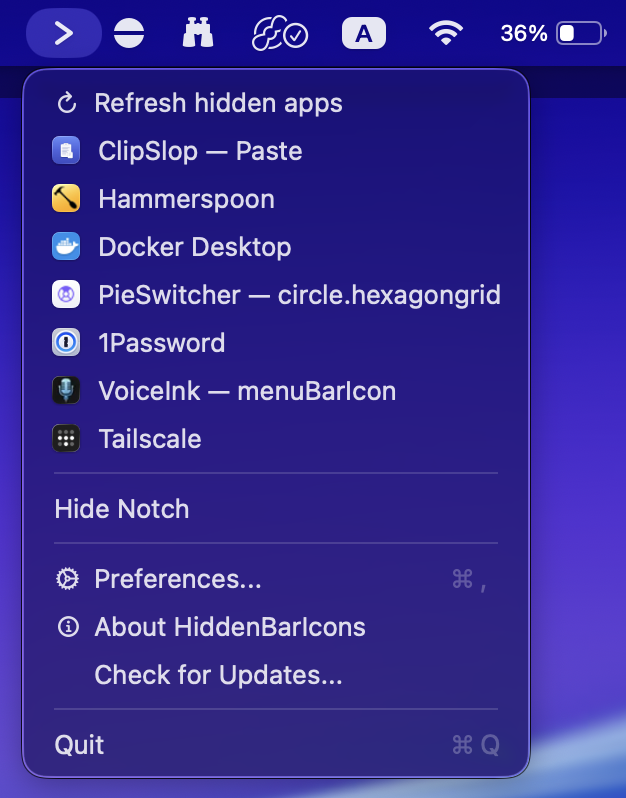

# HiddenBarIcons

A tiny macOS menu-bar app that fixes the **notch problem**: when your menu bar
overflows, macOS hides the icons that would fall under the MacBook notch and you
can no longer reach them. HiddenBarIcons adds (ironically) one more menu-bar icon
— click it and your hidden icons are revealed.

<p align="center">
  
</p>

> Status-bar-only app (no Dock icon). macOS 14 (Sonoma) and later. Universal
> (Apple Silicon + Intel). Auto-updates via [Sparkle](https://sparkle-project.org).

## Install

Install with [Homebrew](https://brew.sh):

```sh
brew install --cask mekedron/tap/hiddenbaricons
```

Or download the **`.dmg`** from the
[latest release](https://github.com/mekedron/HiddenBarIcons/releases/latest), open it,
and drag **HiddenBarIcons** into **Applications**. Builds are signed with a Developer ID
and notarized by Apple, so they open without a Gatekeeper prompt — and the app keeps
itself up to date automatically.

## How it works

HiddenBarIcons places **two** status items in your menu bar:

- a **separator** ` | ` — drag the icons you want to hide to its **left**;
- an **arrow** — **left-click** it (or press **⌘⌥B**) to collapse/expand.

When collapsed, the separator stretches to push everything on its left off-screen
(behind the notch / off the edge); expanding brings them back. **Right-click** (or
**⌃-click**) the arrow for the menu: Preferences, Check for Updates, Hide/Show
Notch (on notched Macs), the list of currently-hidden apps (with Accessibility
granted), and Quit.

### Features

- One-click collapse/expand of your menu-bar icons, plus a global **⌘⌥B** hotkey.
- **Auto-collapse** after a configurable delay.
- **Full-expand mode** — temporarily shows a Dock icon and an empty menu bar to
  free up the whole bar.
- **Hidden-apps list** — using the Accessibility API, lists the menu-bar items
  currently hidden so you can click one to open it (optionally right-click it).
- **Hide/Show Notch** — switches the built-in display to a notchless 16:10 mode.
- **Hold ⌘** to peek the separator when "hide separator when expanded" is on.

## Building

The Xcode project is generated from [`project.yml`](project.yml) with
[XcodeGen](https://github.com/yonaskolb/XcodeGen). The generated
`HiddenBarIcons.xcodeproj` **is committed**, so a plain clone builds in Xcode or
from the command line with no extra tooling.

```sh
# Open in Xcode and run, or build from the CLI:
xcodebuild build -project HiddenBarIcons.xcodeproj -scheme HiddenBarIcons -configuration Debug
```

If you change `project.yml`, regenerate the project:

```sh
brew install xcodegen
xcodegen generate
```

Regenerate the app icon / menu-bar glyphs (writes into `Assets.xcassets`):

```sh
swift scripts/generate-icon.swift
```

## Releasing

Releases are fully automated by [`.github/workflows/release.yml`](.github/workflows/release.yml).
Push a semver tag and CI builds a universal binary, code-signs it with Developer
ID, notarizes + staples the `.app` and `.dmg`, signs the DMG for Sparkle, creates
a GitHub Release with the DMG, and commits the updated `appcast.xml` to `main`:

```sh
git tag v0.1.0
git push origin v0.1.0
```

> Without signing secrets configured the workflow still runs end-to-end and
> ships an ad-hoc-signed DMG (Gatekeeper will warn) — handy for a first smoke test.

## License

MIT-licensed — see [LICENSE](LICENSE).
